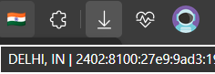

# 🌍 VpnWidget : Server Indicator (Browser Extension)
A lightweight VPN status indicator extension that automatically detects your connected server, shows the country flag as the icon, and displays location + IP address on hover. If the internet is disconnected or the VPN drops, it switches to the default logo and retries every 30 seconds.

## 📸 Screenshots


---

## 🚀 Features
- Shows VPN server flag icon
- Display Location + Country + IP on mouse hover title
- Auto refresh every 30 seconds to detect IP/server change
- No popup, no UI, no tracking — clean & minimal
- Offline/Disconnected mode shows default app logo
- Supports dynamic server switching & VPN provider changes

## 🔧 How It Works
| State | Icon | Hover Text |
|-------|------|-------------|
| Connected to VPN | Dynamic flag | `City, Country | IP` |
| Server changed | New flag auto appears | Updated details |
| No Internet / VPN Unplugged | default.png | `No Internet / Disconnected` |

## 🛠️ Installation (Developer Mode)
1. Download / clone the folder
2. Open Chrome → chrome://extensions/
3. Enable Developer Mode
4. Click Load Unpacked
5. Select the VpnWidget-Extension folder
6. Pin it


## ⚙️ Auto Server Status
Runs IP lookup + flag update every 30 seconds:
```
chrome.alarms.create("updateVPN", { periodInMinutes: 0.5 });
```

## 📄 License
Licensed under MIT License.

## 🧑‍💻 Author & Credits
| Role | Information |
|------|--------------|
| **Developer** | `code.itzpa1` |
| **Skills** | App / Web Developer |
| **Instagram** | https://instagram.com/code.itzpa1 |
| **GitHub** | https://github.com/itzpa1 |
| **Project** | VPN IP & Location Extension |
| **Year** | © 2025 |

---

## ⭐ Support
If you like this project:
```
⭐ Star the repository
🛠️ Contribute or open issues
```

---
